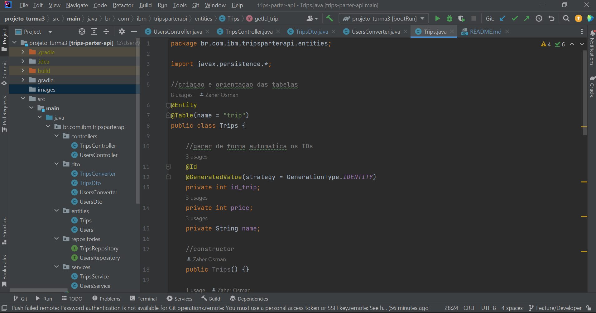
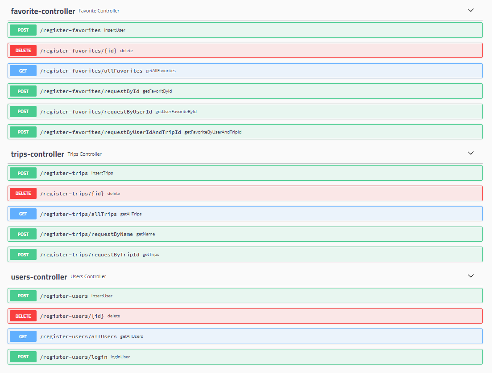

<a name="inicio"></a>
<h1 align="center"> Project Trip's Partner</h1>



<h1 align="center"> 🔗 Java </h1>
<p align="center"> 🚀 lib para construir APIs que consomem informaçoes de App Android </p>


<p align="center">
 <a href="#objetivo">Objetivo</a> •
 <a href="#proposta">Proposta</a> •
 <a href="#features">Features</a> •
 <a href="#requisitos">Requisitos e Roteiro</a> • 
 <a href="#tecnologias">Tecnologias</a> • 
 <a href="#contribuicao">Contribuição</a> •
<a href="#Swagger">Swagger</a> •
 <a href="#autor">Autor</a>
</p>

<h4 align="center"> 
	🚧  Java Select 🚀 Em construção...  🚧
</h4>

<a name="objetivo"></a>
<h1 align="center"> 🚀 Objetivo </h1>

<p> Este projeto tem como resultado esperado, colocar em prática os conhecimentos obtidos através do treinamento Java da Turma 3 de Associates da conta Bradesco. Como objetivo complementar, a realização desse projeto visa uma integração com o curso de front end Android, realizado anteriormente pela turma.</p>
<a href="#inicio">(inicio)</a>


<a name="proposta"></a>
<h1 align="center"> 🔗 Proposta </h1>

<p> Fazer um backend utilizando as tecnologias e padrões apresentados no curso, este projeto backend deve trazer informações do banco de dados para serem mostradas na tela livre (tela surpresa) do aplicativo Android que foi criado no treinamento android, ministrado pela professora Daiane, anterioremente a este curso.</p>
<a href="#inicio">(inicio)</a>


<a name="features"></a>
<h1 align="center"> 🔗 Features</h1>


## Usuario

- [x] Inserir Usuarios
- [x] Favoritar Usuarios
- [x] Listagem de Usuarios
- [x] Deletar Usuarios


## Viagem

- [x] Inserir Viagens
- [x] Favoritar Viagens
- [x] Listagem de Viagens
- [x] Deletar Viagens


## Favoritos

- [x] Inserir pacotes aos favoritos
- [x] Favoritar pacotes aos favoritos
- [x] Listagem de pacotes aos favoritos
- [x] Deletar pacotes aos favoritos

<a href="#inicio">(inicio)</a>

<a name="requisitos"></a>
<h1 align="center"> ✅ Começando</h1>


### Pré-Requisito
Antes de começar, você vai precisar ter instalado em sua máquina as seguintes ferramentas:
[Git](https://git-scm.com),[Postgree](https://www.postgresql.org/download/), [Java JDK](https://download.oracle.com/java/17/archive/jdk-17.0.4_windows-x64_bin.exe).
Além disto é bom ter um editor para trabalhar com o código como  [Intelij](https://www.jetbrains.com/pt-br/idea/).

### 🎲 Rodando o Back End (servidor)

```bash
# Clone este repositório
$ git clone https://github.ibm.com/zaher-osman/projeto-turma3.git

# Acesse a pasta do projeto no terminal/cmd
$ cd projeto-turma3


```

### ✅ Roteiro

<ol>
  <li>"Abrir editor escolhido"</li>
  <li>"Ir em "File" -> Open</li>
  <li>"Encontrar local no qual o clone foi gerado"</li>
  <li>"Clicar em "current file" ao lado do icone de start "seta verde na parte superior do editor"</li>
  <li>"em seguida "edit configurations..."</li>
  <li>"em seguida clicar no icone "+" na parte superior esquerda</li>
  <li>"selecionar "gradle"</li>
  <li>"Na primeira janela de texto abaixo de "Run" clicar e selecionar BootRun</li>
  <li>"Clicar em "Apply" na parte inferior da janela, em seguida em "ok"</li>
  <li>"pronto ja temos um atalho mais pratico para iniciar nosso projeto</li>
  <li>"Agora apenas clicar no icone de start "seta verde na parte superior do editor"</li>
</ol>
<a href="#inicio">(inicio)</a>

<a name="tecnologias"></a>
<h1 align="center">🛠 Tecnologias</h1>


As seguintes ferramentas foram usadas na construção do projeto:

- [![Spring][Spring]][Spring-url]
- [![Git][Git]][Git-url]
- [![PostGre][PostGre]][PostGre-url]
- [![Intelij][Intelij]][Intelij-url]
- [![Java][Java]][Java-url]
- [![Gradle][Gradle]][Gradle-url]
- [![GitHub][GitHub]][GitHub-url]
- [![SimpleIcons][SimpleIcons]][SimpleIcons-url]


<a name="construibuicao"></a>
<h1 align="center">✅ Contribuição</h1>

<ol>
  <li>Bifurcar o projeto</li>
  <li>Crie sua ramificação de recurso ( git checkout -b feature/APIFeature)</li>
  <li>Confirme suas alterações ( git commit -m 'Add some APIFeature')
  <li>Empurre para a Filial ( git push origin feature/APIFeature)</li>
  <li>Abra uma solicitação de pull</li>
</ol>
<a href="#inicio">(inicio)</a>

<a name="Swagger"></a>
<h1 align="center">✅ Swagger</h1>


<a href="#inicio">(inicio)</a>


<a name="autor"></a>
<h1 align="center">🚀 Autor </h1>

<p> Zaher osman - <a href="https://www.linkedin.com/in/zaher-osman-5a8a5b235/">Linkedin</a></p>
<p> Email - zaher.osman@ibm.com </p>
<a href="#inicio">(inicio)</a>


[Spring]: https://img.shields.io/badge/Spring-6DB33F?style=for-the-badge&logo=spring&logoColor=white
[Spring-url]: https://spring.io/

[Git]: https://img.shields.io/badge/Git-F05032?style=for-the-badge&logo=Git&logoColor=white
[Git-url]: https://git-scm.com/

[PostGre]: https://img.shields.io/badge/PostgreSQL-4169E1?style=for-the-badge&logo=PostgreSQL&logoColor=white
[PostGre-url]: https://www.postgresql.org/download/

[Intelij]: https://img.shields.io/badge/IntelliJ_IDEA-000000?style=for-the-badge&logo=IntelliJ-IDEA&logoColor=white
[Intelij-url]: https://www.jetbrains.com/pt-br/idea/

[Java]: https://img.shields.io/badge/OpenJDK-F80000?style=for-the-badge&logo=OpenJDK&logoColor=black
[Java-url]: https://download.oracle.com/java/17/archive/jdk-17.0.4_windows-x64_bin.exe

[Gradle]: https://img.shields.io/badge/Gradle-02303A?style=for-the-badge&logo=Gradle&logoColor=white
[Gradle-url]: https://gradle.org/

[GitHub]: https://img.shields.io/badge/GitHub-181717?style=for-the-badge&logo=GitHub&logoColor=white
[GitHub-url]: https://github.com/

[SimpleIcons]: https://img.shields.io/badge/Simple_Icons-111111?style=for-the-badge&logo=Simple-Icons&logoColor=white
[SimpleIcons-url]: https://simpleicons.org/
