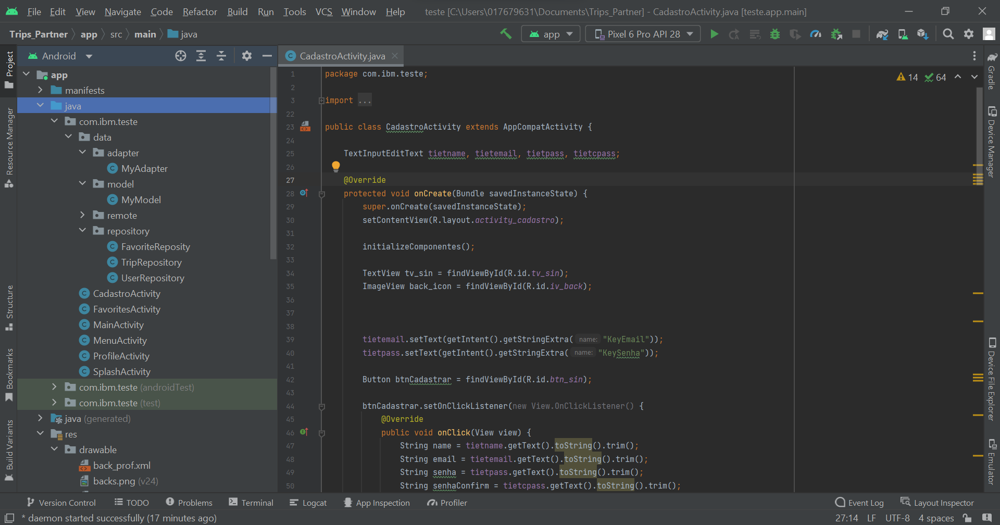

<a name="inicio"></a>
<h1 align="center"> Project Trip's Partner</h1>



<h1 align="center"> 🔗 Android </h1>
<p align="center"> 🚀 lib de um APP Android que é consumido por uma API em Java </p>

<p align="center">
 <a href="#objetivo">Objetivo</a> •
 <a href="#proposta">Proposta</a> •
 <a href="#features">Features</a> •
 <a href="#requisitos">Requisitos e Roteiro</a> • 
 <a href="#tecnologias">Tecnologias</a> • 
 <a href="#contribuicao">Contribuição</a> •
 <a href="#autor">Autor</a>
</p>

<h4 align="center"> 
	🚧  Android Select 🚀 Em construção...  🚧
</h4>

<a name="objetivo"></a>
<h1 align="center"> 🚀 Objetivo </h1>

<b>Objetivo</b>: este projeto tem como resultado esperado, colocar em prática os conhecimentos obtidos através do treinamento Android da Turma 3 de Associates da conta Bradesco. Como objetivo complementar, a realização desse projeto visa uma integração com o curso de back end Java, realizado posteriormente pela turma.
<a href="#inicio">(inicio)</a>

<a name="proposta"></a>
<h1 align="center"> 🔗 Proposta </h1>

<b>Proposta</b>: Fazer um front end utilizando as tecnologias e padrões apresentados no curso, este projeto front end deve trazer informações do banco de dados para serem mostradas na tela livre (tela surpresa) utilizando a API que foi criada no treinamento de Java, ministrado pelo professor Marcus, posteriormente a este curso.
<a href="#inicio">(inicio)</a>

<a name="features"></a>
<h1 align="center"> 🔗 Features</h1>

- [x] Cadastrar nova conta
- [x] Fazer login
- [x] Adicionar viagem como favorito
- [x] Ver informações de perfil
- [ ] Ver lista de viagens favoritadas

<a href="#inicio">(inicio)</a>

<a name="requisitos"></a>
<h1 align="center"> ✅ Começando</h1>

### Pré-Requisito
Antes de começar, você vai precisar ter instalado em sua máquina as seguintes ferramentas:
[Git](https://git-scm.com), [Java JDK](https://download.oracle.com/java/17/archive/jdk-17.0.4_windows-x64_bin.exe).
Além disto é bom ter um editor para trabalhar com código como [Android Studio](https://developer.android.com/studio).

### 🎲 Rodando o Back End (servidor)

```bash
# Clone este repositório
$ git clone https://github.ibm.com/zaher-osman/projeto-turma3-app.git

# Acesse a pasta do projeto no terminal/cmd
$ cd projeto-turma3-app


```

### ✅ Roteiro

<ol>
  <li>"Abrir editor escolhido"</li>
  <li>"Ir em "File" -> Open</li>
  <li>"Encontrar local no qual o clone foi gerado"</li>
  <li>"Agora apenas clicar no icone de start "seta verde na parte superior do editor"</li>
</ol>
<a href="#inicio">(inicio)</a>

<a name="tecnologias"></a>
<h1 align="center">🛠 Tecnologias</h1>

As seguintes ferramentas foram usadas na construção do projeto:

- [![Git][Git]][Git-url]
- [![Android][Android]][Android-url]
- [![Java][Java]][Java-url]
- [![GitHub][GitHub]][GitHub-url]
- [![SimpleIcons][SimpleIcons]][SimpleIcons-url]

<a name="construibuicao"></a>
<h1 align="center">✅ Contribuição</h1>

<ol>
  <li>Bifurcar o projeto</li>
  <li>Crie sua ramificação de recurso ( git checkout -b feature/APPFeature)</li>
  <li>Confirme suas alterações ( git commit -m 'Add some APPFeature')
  <li>Empurre para a Filial ( git push origin feature/APPFeature)</li>
  <li>Abra uma solicitação de pull</li>
</ol>
<a href="#inicio">(inicio)</a>

<a name="autor"></a>
<h1 align="center">🚀 Autor </h1>

<p> Zaher osman - <a href="https://www.linkedin.com/in/zaher-osman-5a8a5b235/">Linkedin</a></p>
<p> Email - zaher.osman@ibm.com </p>
<a href="#inicio">(inicio)</a>

[Git]: https://img.shields.io/badge/Git-F05032?style=for-the-badge&logo=Git&logoColor=white
[Git-url]: https://git-scm.com/

[Java]: https://img.shields.io/badge/OpenJDK-111111?style=for-the-badge&logo=OpenJDK&logoColor=white
[Java-url]: https://download.oracle.com/java/17/archive/jdk-17.0.4_windows-x64_bin.exe

[GitHub]: https://img.shields.io/badge/GitHub-181717?style=for-the-badge&logo=GitHub&logoColor=white
[GitHub-url]: https://github.com/

[SimpleIcons]: https://img.shields.io/badge/Simple_Icons-111111?style=for-the-badge&logo=Simple-Icons&logoColor=white
[SimpleIcons-url]: https://simpleicons.org/

[Android]: https://img.shields.io/badge/Android_Studio-FFFFFF?style=for-the-badge&logo=Android-Studio&logoColor=#3DDC84
[Android-url]: https://developer.android.com/studio